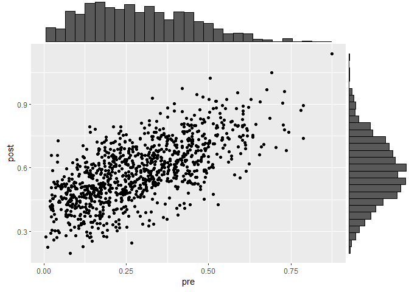

Icon Array
================

Data visualization using icon array charts to communicate validity.
[@AJThurston](twitter.com/AJThurston)

## Introduction

***IN DEVELOPMENT***  
as of 2023-02-19  


This is essentially a follow-up to the data visualization on [expectancy
plots](https://github.com/AJThurston/expectancy). Research has
demonstrated icon arrays are better understood by non-technical
audiences (Zhang et al., 2018)

## Setup and Libraries

As the `waffle` package is not available on CRAN, you will need [Rtools
installed](https://cran.r-project.org/bin/windows/Rtools/) to install
the package from Github.

``` r
library(personograph)
library(summarytools)
library(tidyverse)
library(ggplot2)
library(ggExtra)
```

## Data Import

In this example, these simulated data represent test scores pre and post
training intervention. First, let’s import the example data and quickly
orient ourselves to it. There are three variables in the file:

1.  id: This is just an identifier or a unique participant ID
2.  pre: this is the individual’s pre-training score
3.  post: this is the individual’s post-training score

``` r
# df <- read.csv("https://raw.githubusercontent.com/AJThurston/iconarray/master/iconarray.csv")
df <- read.csv("iconarray.csv")
df %>%
  select(pre,post) %>%
  descr(.)
```

    ## Descriptive Statistics  
    ## df  
    ## N: 1000  
    ## 
    ##                        post       pre
    ## ----------------- --------- ---------
    ##              Mean      0.58      0.29
    ##           Std.Dev      0.15      0.16
    ##               Min      0.19      0.01
    ##                Q1      0.48      0.16
    ##            Median      0.58      0.27
    ##                Q3      0.68      0.40
    ##               Max      1.14      0.87
    ##               MAD      0.15      0.18
    ##               IQR      0.20      0.24
    ##                CV      0.25      0.55
    ##          Skewness      0.18      0.47
    ##       SE.Skewness      0.08      0.08
    ##          Kurtosis     -0.09     -0.30
    ##           N.Valid   1000.00   1000.00
    ##         Pct.Valid    100.00    100.00

``` r
p <- ggplot(df, aes(x = pre, y = post)) +
      geom_point() +
      theme(legend.position="none")
p <- ggMarginal(p, type="histogram")
p
```

<!-- --> Observe the fact that
pre training scores are heavily positively skewed, the post-training
scores are normally distributed, and the correlation between scores is
about .66.

## Determining Pass/Fail

Based on the number of quantiles indicated in the parameter above, now
we actually need to calculate the thresholds between each of the
quantiles then assign each predicted score to a quantile group. The
first bit of code here calculates the quantiles with the `quantile`
function.

``` r
df$pre_passed <- cut(df$pre, .5)
quantiles
```

In another approach, we may want to use a logical grouping of scores to
make the decision. For example:

- Group 1: Scores from 0 to 39
- Group 2: Scores from 40 to 49
- Group 3: Scores from 50 to 59
- Group 4: Scores from 60 to 69
- Group 5: Scores from 70 to 100

It’s best to work with the client in advance to set expectations and
understand what model will best meet their needs.

## Icon Array Plot

In many cases it is easier to simply take these values and display them
in, for example, a PowerPoint plot. However, if you have to automate
this tast for multiple criteria, the code below may be useful for this
purpose.

``` r
pre <- list(failed=0.73, passed=0.27)

svg("iconarray_pre.svg",
    width = 4, 
    height = 8)

personograph(pre,  
             colors=list(failed = "gray", passed="#336666"),
             draw.legend = FALSE, 
             dimensions=c(10,10))
# trace(personograph, edit = T)


dev.off()
```

    ## png 
    ##   2

``` r
post <- list(failed=0.42, passed=0.58)


svg("iconarray_post.svg",
    width = 4, 
    height = 8)

personograph(post,  
             colors=list(failed = "gray", passed="#336666"),
             draw.legend = FALSE, 
             dimensions=c(10,10))

dev.off()
```

    ## png 
    ##   2

## Export

Export the pass/fail data for use elsewhere.

``` r
write.csv(data, "iconarray_appended.csv")
```

## References

Zhang, D. C., Highhouse, S., Brooks, M. E., & Zhang, Y. (2018).
Communicating the validity of structured job interviews with graphical
visual aids. International Journal of Selection and Assessment,
September 2017, ijsa.12220. <https://doi.org/10.1111/ijsa.12220>

## Appendix: Alternatives

The `personograph` function is quite old at this point, and could not
have taken advantage of the `ggplot` functionanility at the time it was
developed. In creating this tutorial, I spent nearly two days trying to
get other, more recent R packages which do leverage `ggplot` to work
and, unfortunately, neither of the two I tried resulted in a satisfying
conclusion.

Originally, this tutorial was designed to make heavy use of the `waffle`
R package, namely the `geom_waffle` function:
<https://github.com/hrbrmstr/waffle>. The `ggwaffle` package is another
alternative: <https://github.com/liamgilbey/ggwaffle>. If you wanted to
make waffle charts instead of icon arrays, I highly recommend both, but
my personal preference is `ggwaffle`.

Two briefly recap my frustration with trying to use these packages for
icon arrays, it really boils down to two main problems:

1.  Spending a considerable amount of time diagnosing issues related to
    installing icons using `geom_icon`
2.  Spending a considerable amount of computing time waiting for images
    to render using `geom_images`

Plainly, I was never successful in getting fonts to install and pull
into R appropriately for `geom_icon` which does plot quickly. This is
more driven by the issues of propriety related to font formats. Even
with Font Awesome successfully downloaded and installed. With
`geom_images`, my 24 core CPU struggled to render icon arrays in a
timely manner.

Finally, if you want a no code solution to icon arrays, please consider
University of Michigan’s [iconarray.com](https://iconarray.com). I
typically steer people away from GUI-based solutions, but I modeled my R
based solution off what I was able to produce there.
